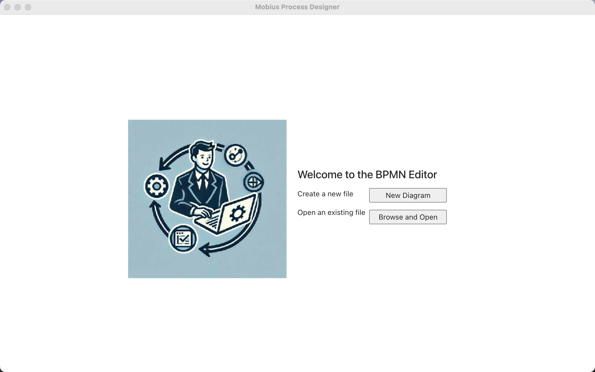
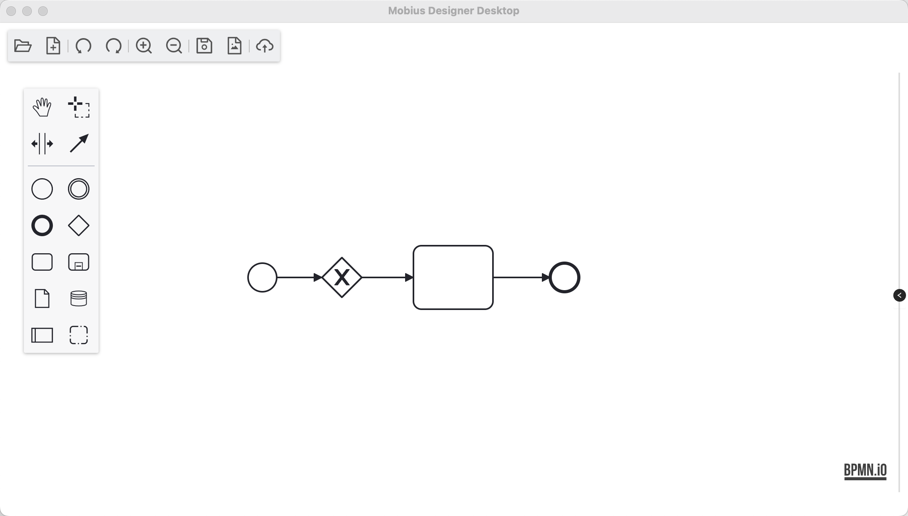

<div align="center">

# 🎨 Mobius Designer Desktop


**A powerful desktop application for modeling and designing BPMN diagrams**

Built with Angular, Electron, and BPMN.js for a seamless cross-platform experience

[](LICENSE)
[](https://angular.io)
[](https://electronjs.org)
[](https://bpmn.io)

[✨ Features](#features) • [📸 Screenshots](#screenshots) • [🚀 Quick Start](#installation) • [📖 Documentation](#development)

</div>

---

## 📋 Overview

Mobius Designer Desktop is a comprehensive **BPMN diagram editor** designed for professional modeling and design. It provides an intuitive interface for creating, editing, and managing business process diagrams locally.

## ✨ Features

<table>
<tr>
<td>

### 🎨 **Visual Editor**
- Intuitive drag-and-drop interface
- Real-time diagram rendering
- Professional BPMN notation

</td>
<td>

### 🖥️ **Cross-Platform**
- Windows, macOS, and Linux
- Native desktop performance
- Consistent user experience

</td>
</tr>
<tr>
<td>

### 📊 **BPMN 2.0 Compliant**
- Full specification support
- Standards-compliant exports
- Professional modeling tools

</td>
<td>

### 🛠️ **Advanced Tools**
- Comprehensive editing toolbar
- Properties panel
- Context-aware actions

</td>
</tr>
</table>

## 📸 Screenshots

### Main Designer Interface


### BPMN Diagram Editor


### Properties Panel & Tools


## 🛠️ Technology Stack

<div align="center">

| Technology | Version | Purpose |
|:----------:|:-------:|:-------:|
|  | 17.3.x | Frontend Framework |
|  | 33.x | Desktop Runtime |
|  | Latest | Type Safety |
|  | 18.x | BPMN Engine |
|  | ng-zorro | UI Components |

</div>

## 🚀 Quick Start

### Prerequisites

<div align="center">


</div>

### Installation

```bash
# 1️⃣ Clone the repository
git clone https://github.com/your-username/designer-desktop.git
cd designer-desktop

# 2️⃣ Install dependencies
npm install

# 3️⃣ Start the application
npm start
```

> 🎉 **That's it!** The application will launch automatically.``

## 💻 Development

### 🔧 Available Commands

```bash
# Development
npm start              # 🚀 Start development server + Electron app
npm run watch          # 👀 Watch mode for Angular changes
npm test               # 🧪 Run tests

# Building
npm run build          # 🏗️ Build Angular application
npm run dist:all       # 📦 Build for all platforms
npm run dist:mac       # 🍎 Build for macOS
npm run dist:win       # 🪟 Build for Windows
npm run dist:linux     # 🐧 Build for Linux
```

### 📁 Project Structure

```
📦 designer-desktop/
├── 🎯 src/
│   ├── 📱 app/
│   │   ├── 🎨 pages/
│   │   │   ├── 🖌️ designer/          # BPMN designer components
│   │   │   │   ├── designer-ui/       # Main designer interface
│   │   │   │   └── edit-tools/        # Editing tools & toolbar
│   │   │   ├── 🏠 home/              # Home page components
│   │   │   └── ⚙️ service/           # Application services
│   │   └── 🎭 assets/                # Static assets & icons
│   ├── 🌐 locale/                    # i18n files
│   └── 🎨 styles.less               # Global styles
├── 📋 package.json                   # Dependencies & scripts
├── ⚡ app.js                        # Electron main process
└── 🔧 preload.js                    # Electron preload script
```

## 📦 Building for Production

### 🏗️ Build Commands

<table>
<tr>
<td align="center">

**🌍 All Platforms**
```bash
npm run dist:all
```

</td>
<td align="center">

**🍎 macOS**
```bash
npm run dist:mac
```

</td>
</tr>
<tr>
<td align="center">

**🪟 Windows**
```bash
npm run dist:win
```

</td>
<td align="center">

**🐧 Linux**
```bash
npm run dist:linux
```

</td>
</tr>
</table>

> 📂 Built applications will be available in the `release/` directory.

## 🧩 Key Components

<details>
<summary><strong>🎨 Designer Interface</strong></summary>

- **Designer UI Component**: Main BPMN diagram editing interface
- **Edit Tools**: Comprehensive toolbar with editing capabilities  
- **Custom Context Pad**: Enhanced context menu for BPMN elements
- **Properties Panel**: Element properties and configuration

</details>

<details>
<summary><strong>⚙️ Core Services</strong></summary>

- **Electron Service**: Desktop integration and native functionality
- **Title Service**: Window title management  
- **Util Service**: Common utility functions

</details>

## 📄 Supported File Formats

| Format | Support | Description |
|:------:|:-------:|:------------|
| 📝 **BPMN 2.0 XML** | ✅ Full | Native format for business process models |
| 🖼️ **SVG** | ✅ Export | Scalable vector graphics export |
| 📄 **PDF** | ✅ Export | High-quality document generation |

## 🤝 Contributing

We welcome contributions! Here's how you can help:

<div align="center">

[](https://github.com/your-username/designer-desktop/graphs/contributors)
[](https://github.com/your-username/designer-desktop/pulls)
[](https://github.com/your-username/designer-desktop/issues?q=is%3Aissue+is%3Aopen+label%3A%22good+first+issue%22)

</div>

### 🚀 Getting Started

1. **🍴 Fork** the repository
2. **🌿 Create** a feature branch
   ```bash
   git checkout -b feature/amazing-feature
   ```
3. **✨ Commit** your changes
   ```bash
   git commit -m 'Add some amazing feature'
   ```
4. **📤 Push** to the branch
   ```bash
   git push origin feature/amazing-feature
   ```
5. **🎯 Open** a Pull Request

### 📋 Development Guidelines

- Follow the existing code style
- Add tests for new features
- Update documentation as needed
- Use meaningful commit messages

## 📄 License

<div align="center">

This project is licensed under the **MIT License** - see the [LICENSE](LICENSE) file for details.

[](LICENSE)

</div>

## 💬 Support & Contact

<div align="center">

| Contact | Information |
|:-------:|:-----------:|
| 📧 **Email** | mobius.bpm@gmail.com |
| 🐛 **Issues** | [GitHub Issues](https://github.com/your-username/designer-desktop/issues) |
| 💬 **Discussions** | [GitHub Discussions](https://github.com/your-username/designer-desktop/discussions) |

</div>

## 📊 Project Stats

<div align="center">


</div>

---

<div align="center">

**Built with ❤️ using Angular, Electron, and BPMN.js**

⭐ **If you found this project helpful, please give it a star!** ⭐

</div>