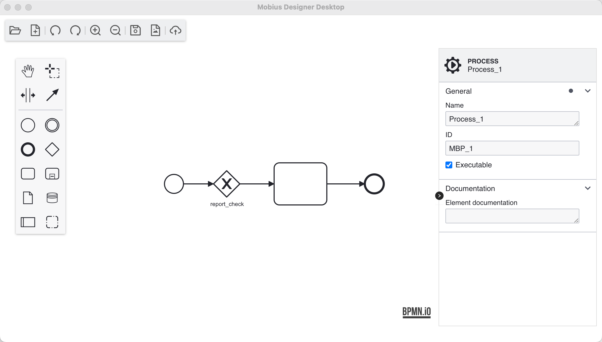

# Mobius Designer Desktop

A powerful desktop application for modeling and designing BPMN diagrams. Built with Angular, Electron, and BPMN.js for a seamless cross-platform experience.

## Overview

Mobius Designer Desktop is a comprehensive BPMN diagram editor designed for professional modeling and design. It provides an intuitive interface for creating, editing, and managing business process diagrams locally.

## Features

**Visual Editor**
- Intuitive drag-and-drop interface
- Real-time diagram rendering
- Professional BPMN notation

**Cross-Platform**
- Windows, macOS, and Linux
- Native desktop performance
- Consistent user experience

**BPMN 2.0 Compliant**
- Full specification support
- Standards-compliant exports
- Professional modeling tools

**Advanced Tools**
- Comprehensive editing toolbar
- Properties panel
- Context-aware actions

## Screenshots

### Main Designer Interface


### BPMN Diagram Editor


### Properties Panel & Tools


Add more screenshots here in the docs/images/ folder.

## Technology Stack

- **Frontend Framework**: Angular 17.3.x
- **Desktop Runtime**: Electron 33.x
- **BPMN Engine**: BPMN.js 18.x
- **UI Components**: ng-zorro-antd (Ant Design for Angular)
- **Styling**: Less CSS
- **Build Tools**: Angular CLI, Electron Builder

## Prerequisites

- Node.js (version 16 or higher)
- npm package manager

## Installation

Clone the repository:
```bash
git clone https://github.com/your-username/designer-desktop.git
cd designer-desktop
```

Install dependencies:
```bash
npm install
```

Start the application:
```bash
npm start
```

The application will launch automatically.

## Development

### Available Commands

```bash
# Development
npm start              # Start development server + Electron app
npm run watch          # Watch mode for Angular changes
npm test               # Run tests

# Building
npm run build          # Build Angular application
npm run dist:all       # Build for all platforms
npm run dist:mac       # Build for macOS
npm run dist:win       # Build for Windows
npm run dist:linux     # Build for Linux
```

### Project Structure

```
designer-desktop/
├── src/
│   ├── app/
│   │   ├── pages/
│   │   │   ├── designer/          # BPMN designer components
│   │   │   │   ├── designer-ui/   # Main designer interface
│   │   │   │   └── edit-tools/    # Editing tools & toolbar
│   │   │   ├── home/              # Home page components
│   │   │   └── service/           # Application services
│   │   └── assets/                # Static assets & icons
│   ├── locale/                    # i18n files
│   └── styles.less               # Global styles
├── package.json                   # Dependencies & scripts
├── app.js                        # Electron main process
└── preload.js                    # Electron preload script
```

## Building for Production

Build for all platforms:
```bash
npm run dist:all
```

Platform-specific builds:
```bash
npm run dist:mac     # macOS
npm run dist:win     # Windows
npm run dist:linux   # Linux
```

Built applications will be available in the `release/` directory.

## Key Components

**Designer Interface**
- Designer UI Component: Main BPMN diagram editing interface
- Edit Tools: Comprehensive toolbar with editing capabilities
- Custom Context Pad: Enhanced context menu for BPMN elements
- Properties Panel: Element properties and configuration

**Core Services**
- Electron Service: Desktop integration and native functionality
- Title Service: Window title management
- Util Service: Common utility functions

## Supported File Formats

- **BPMN 2.0 XML**: Native format for business process models
- **SVG**: Scalable vector graphics export
- **PDF**: High-quality document generation

## Contributing

We welcome contributions! Here's how you can help:

1. Fork the repository
2. Create a feature branch:
   ```bash
   git checkout -b feature/amazing-feature
   ```
3. Commit your changes:
   ```bash
   git commit -m 'Add some amazing feature'
   ```
4. Push to the branch:
   ```bash
   git push origin feature/amazing-feature
   ```
5. Open a Pull Request

### Development Guidelines

- Follow the existing code style
- Add tests for new features
- Update documentation as needed
- Use meaningful commit messages

## License

This project is licensed under the MIT License - see the [LICENSE](LICENSE) file for details.

## Support & Contact

- **Email**: mobius.bpm@gmail.com
- **Issues**: [GitHub Issues](https://github.com/your-username/designer-desktop/issues)
- **Discussions**: [GitHub Discussions](https://github.com/your-username/designer-desktop/discussions)

---

Built with Angular, Electron, and BPMN.js

If you found this project helpful, please give it a star!